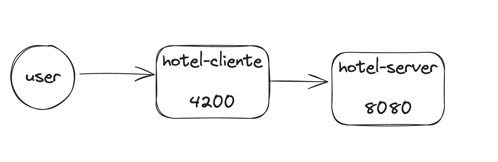

# hotel-client
hotel-client

# Passos criacao do projeto
1. Criar projeto 
- ng new hotel-client
- cd hotel-client
- ng serve
2. Gerar services para consumir na api 
- ng generate service services/cliente
3. Gerar componente cliente 
- ng generate component clientes
4. add componentes no app 
- <hotel-client></hotel-client> 

