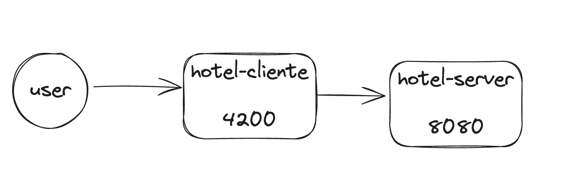

# 🏨 Hotel Client

[](https://angular.dev/)
[](https://www.typescriptlang.org/)
[](https://rxjs.dev/)
[](#)

Aplicação **frontend Angular** para gerenciamento básico de clientes do hotel, consumindo uma API REST.

## 📌 Tags

`angular` `frontend` `typescript` `rxjs` `hotel` `api-rest`

## ✨ Funcionalidades

- Listagem de clientes via API
- Criação de novo cliente
- Estrutura com componente standalone
- Serviço HTTP dedicado para integração

## 🧱 Stack técnica

- Angular 19
- TypeScript
- RxJS
- HttpClient

## 📁 Estrutura do projeto

```text
hotel-client/
└── hotel-client/
	├── src/
	│   ├── main.ts
	│   └── app/
	│       ├── app.component.ts
	│       ├── clientes/
	│       │   └── clientes.component.ts
	│       └── services/
	│           └── cliente.service.ts
	├── angular.json
	└── package.json
```

## ✅ Pré-requisitos

- Node.js 18+
- npm 9+
- Angular CLI 19+

## 🚀 Como executar

1. Acesse a pasta da aplicação Angular:

```bash
cd hotel-client
```

2. Instale as dependências:

```bash
npm install
```

3. Inicie a aplicação:

```bash
npm start
```

4. Abra no navegador:

```text
http://localhost:4200
```

## 🔌 Configuração da API

O serviço de clientes está configurado para:

```text
http://localhost:8080/clientes
```

Arquivo de referência:

- [hotel-client/src/app/services/cliente.service.ts](hotel-client/src/app/services/cliente.service.ts)

## 🛠️ Scripts disponíveis

- `npm start` → sobe o servidor de desenvolvimento
- `npm run build` → gera build de produção
- `npm test` → executa testes unitários

## 📈 Próximos passos (sugestões)

- Criar interface tipada para `Cliente`
- Adicionar tratamento de erros HTTP
- Implementar edição e remoção de clientes
- Configurar ambientes (`environment.ts`) para API

## 👤 Autor

Projeto mantido por **Daniel Smanioto**.

## 🏗️ Arquitetura

Diagrama de arquitetura da solução:


